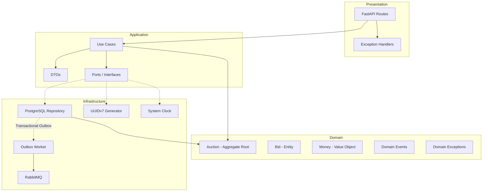

# Auction System

API de leilões em tempo real construída com **Domain-Driven Design** e **Clean Architecture** em Python/FastAPI.

O sistema modela leilões como Aggregate Roots com uma state machine que valida todas as transições de estado, garantindo que regras de negócio nunca sejam violadas — mesmo sob concorrência.

---

## Arquitetura



O domínio é **100% agnóstico à infraestrutura** — não importa nenhum módulo de banco de dados, HTTP ou mensageria.

---

## Decisões Técnicas

### Por que Pessimistic Locking?

Em um leilão, dois usuários podem enviar lances no mesmo milissegundo. Sem lock, ambos leem o mesmo "lance mais alto", ambos validam que o seu lance é suficiente, e ambos salvam — resultando em um lance inválido no banco.

A solução: `SELECT ... FOR UPDATE` na raiz de agregação (`Auction`). O primeiro request trava a linha, valida e salva. O segundo espera, lê o estado atualizado, e valida contra o lance correto.

```python
# infrastructure/repositories/postgres_repository.py
auction_model = (
    self.session.query(AuctionModel)
    .options(joinedload(AuctionModel.bids))
    .filter_by(id=auction_id)
    .with_for_update(of=AuctionModel)  # Lock apenas na raiz
    .first()
)
```

### Por que Transactional Outbox?

O padrão ingênuo é: salvar no banco → publicar no RabbitMQ. Mas se o serviço cair entre os dois passos, o evento se perde.

O Transactional Outbox resolve isso: o evento é salvo **na mesma transação** que o dado de negócio. Um worker separado lê os eventos pendentes e publica no RabbitMQ com Publisher Confirms. Se a publicação falhar, o worker tenta novamente. Garantia de at-least-once delivery.

```
Request → [Transação SQL: salvar lance + salvar evento na outbox] → Commit
Worker  → [Ler outbox → Publicar no RabbitMQ → Marcar como processado] → Commit
```

### Por que UUIDv7?

UUIDv4 é aleatório — inserções em B-Trees causam page splits constantes. UUIDv7 embute um timestamp monotônico nos primeiros bits, o que faz inserções serem sempre sequenciais (append-only na B-Tree). Bônus: `ORDER BY id DESC` substitui `ORDER BY created_at DESC` sem coluna extra, e a paginação por cursor usa o próprio ID.

### Anti-Snipe

Se um lance é colocado nos últimos 30 segundos antes do fechamento, o leilão estende automaticamente por 2 minutos. Isso impede a estratégia de "snipe" (esperar o último segundo pra dar o lance vencedor sem dar tempo de contra-lance).

---

## Stack

| Camada | Tecnologias |
|---|---|
| **Linguagem** | Python 3.13 |
| **Framework** | FastAPI, Pydantic |
| **Banco de Dados** | PostgreSQL, SQLAlchemy 2.0 (Mapped), Alembic |
| **Mensageria** | RabbitMQ (pika), Publisher Confirms |
| **Qualidade** | Pytest (54 testes), Mypy (strict) |
| **Infra** | Docker Compose, GitHub Actions CI |

---

## Como Rodar

```bash
# 1. Subir banco e RabbitMQ
docker-compose up -d

# 2. Instalar dependências
poetry install

# 3. Rodar migrations
poetry run alembic upgrade head

# 4. Subir a API
poetry run uvicorn presentation.api.main:app --reload

# 5. Subir o Outbox Worker (outro terminal)
poetry run python -m infrastructure.workers.outbox_worker
```

A API estará em `http://localhost:8000/docs` (Swagger UI).

---

## Endpoints

| Método | Rota | Descrição |
|---|---|---|
| `POST` | `/auctions` | Criar leilão (DRAFT) |
| `POST` | `/auctions/{id}/start` | Iniciar leilão (DRAFT → ACTIVE) |
| `POST` | `/auctions/{id}/bids` | Dar lance |
| `POST` | `/auctions/{id}/cancel` | Cancelar leilão |
| `POST` | `/auctions/{id}/close` | Fechar leilão (via cron) |
| `GET` | `/auctions` | Listar leilões (com filtros e paginação por cursor) |

---

## Testes

```bash
# Testes unitários e de aplicação (sem banco)
poetry run pytest tests/domain tests/application -v

# Testes de integração (precisa do PostgreSQL rodando)
poetry run pytest tests/integration -v

# Todos
poetry run pytest tests/ -v
```

**54 testes** cobrindo:
- **Domínio:** State machine, regras de lance, anti-snipe, expiração, reserve price
- **Aplicação:** Use cases com repositório in-memory
- **Integração:** Fluxo HTTP completo → banco → outbox events

---

## Estrutura

```
├── domain/                  # Domínio puro (zero dependências externas)
│   ├── entities/            # Auction (Aggregate Root), Bid
│   ├── value_objects/       # Money, Currency
│   ├── events/              # Domain Events
│   ├── exceptions/          # Exceções de negócio
│   └── ports/               # Interfaces (IdGenerator, Clock)
├── application/             # Use Cases e DTOs
│   ├── use_cases/           # CreateAuction, AddBid, StartAuction...
│   ├── ports/               # AuctionRepositoryInterface
│   └── exceptions/          # Exceções de aplicação
├── infrastructure/          # Implementações concretas
│   ├── repositories/        # PostgreSQL + InMemory
│   ├── models/              # SQLAlchemy models
│   ├── workers/             # Outbox Worker (RabbitMQ publisher)
│   └── adapters/            # UUIDv7 generator, System Clock
├── presentation/            # FastAPI (routes, exception handlers)
└── tests/                   # Testes em 3 camadas
```
